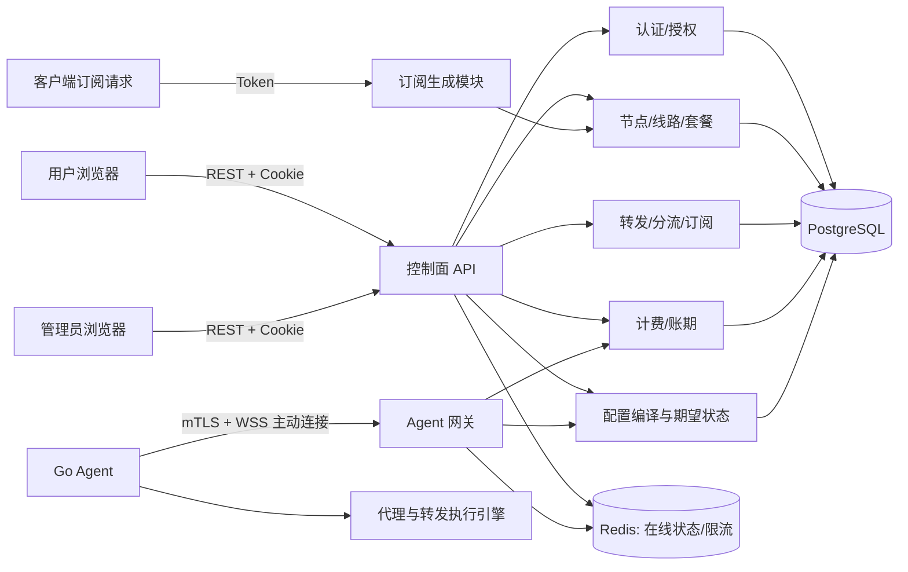
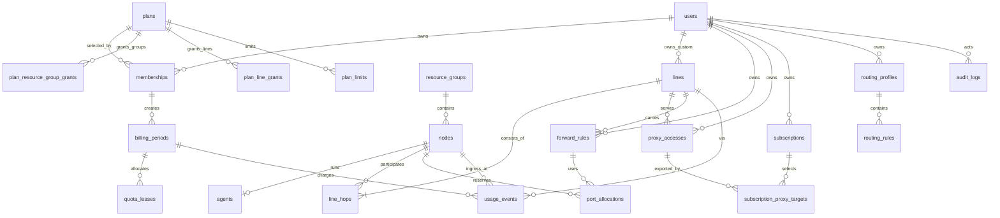

# 代理网络控制平面：架构设计 v0.1

状态：用户已于 2026-09-25 确认。本文定义独立实现的产品与技术边界，不复用 WeiR 的代码、商标、素材或闭源实现。

## 1. 目标、边界与关键选择

本产品管理节点资源、可用线路、端口转发、客户端订阅、分流策略、套餐授权和流量账本。管理员编排全局资源；用户仅能在套餐授权范围内创建自己的连接、转发、订阅和分流规则。节点是实际服务器资源，线路是有序节点路径，转发是占用入口端口并通过路径到达目标的用户规则，三者各有生命周期。

### 架构方案比较

| 方案 | 优点 | 代价 | 结论 |
|---|---|---|---|
| 模块化单体控制面 + 独立 Agent | 一套事务边界，开发和部署直接；领域模块仍可拆分 | 需要严格维持模块边界 | **推荐用于 MVP** |
| 从第一天拆成多个微服务 | 独立扩容、隔离故障 | 跨服务事务、运维和协议版本成本高 | 规模增长后再按模块拆分 |
| 面板直接 SSH 写服务器配置 | 初期实现少 | 密钥与状态管理困难，节点离线时不可可靠收敛 | 不采用 |

推荐前端 React + TypeScript + Vite，控制面 Go，Agent Go，PostgreSQL 存权威业务数据，Redis 存短期在线状态和限流信息。控制面内部按领域划分模块，共享一个部署单元和数据库，但只允许通过模块服务接口访问其他模块的数据。REST API 使用 OpenAPI 3.1 作为契约。Agent 主动建立 HTTPS WebSocket 长连接；服务端保留未来换 gRPC 双向流的传输适配层。桌面优先，手机端保留完整的查看与常用管理能力。

代理数据面由 Agent 管理一个可替换的执行引擎适配器。MVP 选一个经许可核查的现成代理引擎作为首个适配器，统一配置编译与原子重载；产品模型和 API 不暴露引擎私有结构。MVP 客户端连接协议固定为 Trojan over TLS，要求入口节点有可用域名和证书。这样订阅生成器和数据面有一个可验证的共同协议；增加其他协议时通过能力矩阵扩展。端口转发由 Agent 的转发适配器执行，和代理入口分别配置。具体引擎及许可证在编码前的技术验证中锁定，不影响本文领域模型。

### 系统关系



控制面是期望状态的权威来源。Agent 只维护节点上的已应用状态和执行反馈。Redis 故障不得丢失套餐、规则或账本；在线状态可以短暂显示为未知。数据库写入成功后写入同库 outbox 事件，后台编译配置并向在线 Agent 发布新版本；断线 Agent 重连后拉取完整快照。发布到 Agent 是最终一致的，API 响应应同时给出 `desired_revision` 与 `applied_revision`，UI 明确显示“待下发 / 已生效 / 下发失败”。

## 2. 领域模型与主要流程

### 资源关系

- **节点 `node`**：一台可由 Agent 管理的服务器及其网络入口。`capabilities` 包含 `proxy`、`forward`，可同时具有两种能力。一个节点归属一个资源组，可另有多个标签。在线与负载是观测值，不能和管理员设置的 `enabled` 混为一谈。
- **线路 `line`**：由有序 `line_hops` 组成。管理员可维护共享线路，用户可在套餐许可时基于获授权节点创建自有线路。单跳线路由代理出口节点组成；多跳线路首跳需具备代理入口能力，中间跳具有 `forward` 能力，末跳具有 `proxy` 能力。每个 hop 的角色为 `ingress`、`relay`、`egress`；单跳用 `egress`，同时承担入口功能。线路有启停、权重、优先级、标签和倍率。路径校验禁止重复节点、环路和不可达的能力组合。
- **转发规则 `forward_rule`**：用户拥有的监听端口、协议、目标和可选线路。入口节点必须支持 `forward`。多跳时引用一条从入口到目标节点的线路；单跳可直接指定目标节点。远端地址仅允许管理员批准的目标类型和端口范围，避免开放任意内网访问。入口节点、协议、端口的占用由唯一约束和端口分配表保证。
- **代理连接 `proxy_access`**：用户拥有的一组客户端凭据与所选线路，独立于订阅；启停、凭据轮换和 Agent 下发有自己的状态。订阅只是把这些连接按目标客户端格式导出，不能凭空生成没有对应执行配置的连接。首版一个连接绑定一条单跳线路，凭据轮换会撤销旧连接凭据。
- **订阅 `subscription`**：用户拥有的配置视图，绑定代理连接集合及客户端名称模板；连接可选择单节点线路或以后开放的多跳线路，因此订阅能按节点或线路挑选。输出格式由请求路径决定。Token 控制读访问，禁用、重置后立即失效。订阅只展示当前授权且健康条件满足的资源。
- **分流策略 `routing_profile`**：用户拥有的规则集和 fallback；规则命中目标为 `DIRECT`、`BLOCK` 或一条有权限的线路。规则匹配类型为 domain、domain_suffix、IP、CIDR、GeoIP、GeoSite。用户编辑后生成配置版本；客户端是否支持某条规则由格式生成器明确校验。
- **套餐 `plan` 与订购 `membership`**：套餐定义额度、账期、资源组/线路授权、每节点转发上限和默认倍率。订购记录生效区间、状态、当期快照。正在进行的账期使用已冻结的授权和倍率快照；套餐调整在下一账期生效，管理员可显式执行即时变更并留下审计记录。
- **授权与倍率决策**：共享线路必须同时满足显式线路授权与所有 hop 的节点组授权；自有线路需要套餐允许自建且所有 hop 属于获授权节点组。未列入授权表的共享资源默认不可用。计费倍率优先取线路倍率，未指定线路时取节点倍率，再回退到套餐默认倍率；连接建立时冻结该值。用户不能自行设定线路倍率，自有线路的倍率由套餐与节点策略计算。倍率和授权变更只影响新连接，活跃连接继续使用创建时快照。

### 生命周期

1. 管理员录入资源组、节点、线路和套餐，Agent 入网。节点有 `enabled` 且 Agent 在线后才可供用户创建配置。
2. 用户创建代理连接或转发规则时，服务端校验身份、套餐状态、节点组/线路授权、能力；转发还校验端口和每节点规则数。事务内创建资源及必要的端口占用，并写 outbox。
3. 编译器按节点产生完整期望配置，递增 `config_revision`。Agent 校验、预加载、原子切换后 ACK；失败则保留旧配置并 NACK。数据库保留期望版本和最近成功版本。
4. Agent 在客户端入口处对一个逻辑连接采集上传与下载字节。多跳中继不再次向用户计费。事件按 `connection_id + sequence` 去重，账本记原始流量、倍率快照和计费流量。
5. 定期任务依据订购的时区和锚定日创建新账期并重置可用额度。月付的 29、30、31 日在短月按当月最后一天计算，之后仍使用原锚定日。

### 状态与失败原则

- 业务写入采用数据库事务；配置下发和统计聚合通过 outbox 异步重试。任何重试都用幂等键防重复。
- 创建成功不代表 Agent 已应用；规则操作状态有 `pending`、`active`、`apply_failed`、`disabled`。
- Agent 心跳超过 45 秒未到达显示 `offline`；15 秒心跳为建议默认值。配置从断连恢复时先比较版本，再发送完整快照。
- 账期额度由控制面按用户、账期给 Agent 发放有限的**计费字节**租约。Agent 本地按连接倍率消耗租约，租约耗尽或离线时拒绝新连接，阻止多个入口并发超发。报告和租约对账可重放；不可回收的已发租约在过期后结算。MVP 可以先用较小租约与短报告间隔实现，接受单个已建立连接在截止瞬间产生的有限超额，并在产品文案明确这一边界。

## 3. 数据库 ER 模型



资源授权和订阅目标在物理模型中分别拆成节点/线路关联表，保持外键完整性。ER 图以目标集合表示逻辑关系。所有主键使用 UUIDv7，时间统一存 UTC `timestamptz`，展示时按账户/套餐时区转换，流量使用 `bigint` 字节，不使用浮点数。

## 4. 核心数据表

| 表 | 核心字段 | 约束与索引 |
|---|---|---|
| `users` | `id`, `email`, `password_hash`, `status`, `timezone`, `created_at` | `email` 唯一；停用不删除账本 |
| `roles`, `permissions`, `user_roles`, `role_permissions` | 角色及权限码关系 | 角色默认 `user`、`admin`；权限码如 `nodes.write` |
| `plans` | `id`, `name`, `billing_mode`, `period_months`, `quota_bytes`, `default_multiplier_milli`, `status` | 倍率以千分位整数表示，如 1000=×1；`billing_mode` 首版为锚定日月付 |
| `plan_limits` | `plan_id`, `max_forward_rules_per_node`, `max_subscriptions`, `max_routing_rules`, `allow_custom_lines`, `max_custom_lines`, `max_hops` | 各上限非负；首版最大 hop 数为 1 |
| `plan_resource_group_grants`, `plan_line_grants` | `plan_id`, `resource_group_id` / `line_id`, `allowed` | 组合唯一；默认拒绝 |
| `memberships` | `id`, `user_id`, `plan_id`, `starts_at`, `ends_at`, `status`, `anchor_day`, `timezone`, `snapshot_json` | 同一用户同一时间最多一个生效主套餐；保留历史 |
| `billing_periods` | `id`, `membership_id`, `starts_at`, `ends_at`, `quota_bytes`, `raw_bytes`, `charged_bytes`, `status` | `(membership_id, starts_at)` 唯一；时间区间不重叠 |
| `resource_groups` | `id`, `code`, `name`, `region`, `enabled` | `code` 唯一，例如 `RFC.JPT1` |
| `nodes` | `id`, `group_id`, `name`, `region`, `host`, `public_ip`, `proxy_port`, `capabilities`, `bandwidth_bps`, `multiplier_milli`, `tags`, `enabled` | `host + proxy_port` 按需唯一；静态元数据与实时指标分离 |
| `agents` | `id`, `node_id`, `cert_fingerprint`, `version`, `desired_revision`, `applied_revision`, `last_seen_at`, `status` | `node_id` 唯一；证书指纹唯一 |
| `agent_metrics` | `node_id`, `observed_at`, `cpu_pct`, `memory_used_bytes`, `tx_bytes`, `rx_bytes`, `connections`, `latency_ms` | 按时间分区；保留策略，例如明细 30 天 |
| `lines` | `id`, `owner_user_id`, `name`, `enabled`, `priority`, `weight`, `multiplier_milli`, `tags`, `created_by` | `owner_user_id` 为空表示共享线路；名称按用户/全局范围唯一；倍率大于 0 |
| `line_hops` | `line_id`, `position`, `node_id`, `role` | `(line_id, position)` 唯一；`(line_id, node_id)` 唯一 |
| `proxy_accesses` | `id`, `user_id`, `line_id`, `name`, `credential_hash`, `credential_ciphertext`, `enabled`, `apply_status`, `created_at` | 只保存必要的加密凭据与验证材料；用户和线路索引 |
| `forward_rules` | `id`, `user_id`, `name`, `ingress_node_id`, `ingress_port`, `target_node_id`, `target_host`, `target_port`, `line_id`, `protocol`, `enabled`, `apply_status` | `protocol` 为 TCP/UDP/BOTH；目标节点或目标地址择一；线路端点一致 |
| `port_allocations` | `id`, `node_id`, `protocol`, `port`, `owner_type`, `owner_id`, `released_at` | 未释放的 `(node_id, protocol, port)` 唯一；BOTH 占用两条记录 |
| `subscriptions` | `id`, `user_id`, `name`, `enabled`, `token_hash`, `token_ciphertext`, `name_template`, `routing_profile_id`, `created_at` | Token 高熵随机；Hash 唯一；密文供所有者重新查看 URL |
| `subscription_proxy_targets` | `subscription_id`, `proxy_access_id`, `sort_order` | 组合唯一；生成时再次鉴权；连接已绑定线路 |
| `routing_profiles` | `id`, `user_id`, `name`, `fallback_kind`, `fallback_line_id`, `enabled`, `revision` | fallback 线路必须有权限 |
| `routing_rules` | `id`, `profile_id`, `priority`, `match_type`, `match_value`, `action`, `line_id`, `enabled` | `(profile_id, priority)` 唯一；按优先级升序首匹配 |
| `usage_events` | `id`, `billing_period_id`, `user_id`, `ingress_node_id`, `line_id`, `connection_id`, `sequence`, `uploaded_bytes`, `downloaded_bytes`, `multiplier_milli`, `charged_bytes`, `observed_at` | `(connection_id, sequence)` 唯一；按账期/日期分区；只追加 |
| `quota_leases` | `id`, `billing_period_id`, `agent_id`, `granted_bytes`, `consumed_bytes`, `expires_at`, `state` | 发放时锁定账期额度，保证未消费租约之和不超过剩余额度 |
| `config_revisions`, `outbox_events` | 节点、版本、配置摘要、创建/应用时间；事件类型、载荷、重试状态 | `(node_id, revision)` 唯一；事件幂等键唯一 |
| `audit_logs` | `id`, `actor_user_id`, `action`, `object_type`, `object_id`, `before_json`, `after_json`, `request_id`, `created_at` | 只追加；敏感值脱敏 |

补充索引：`usage_events(user_id, observed_at)`、`usage_events(ingress_node_id, observed_at)`、`usage_events(line_id, observed_at)`；列表类资源按 `user_id, created_at`；指标表按 `node_id, observed_at DESC`。日报表 `usage_daily` 从账本幂等聚合，首页读日报加当天实时增量，不把日报当权威账本。

## 5. REST API 契约

统一前缀 `/api/v1`，JSON 字段使用 `snake_case`。后台会话采用 `HttpOnly; Secure; SameSite=Lax` Cookie + CSRF token；Agent 不复用用户认证。列表使用 `limit`、`cursor`、过滤和排序，响应返回 `items`、`next_cursor`。写操作可传 `Idempotency-Key`；并发修改使用 `ETag` / `If-Match`，冲突返回 409。错误统一格式：`{ "error": { "code": "PLAN_LIMIT_EXCEEDED", "message": "...", "details": {}, "request_id": "..." } }`。常见状态码为 400、401、403、404、409、422、429、503。错误码稳定且可写入 OpenAPI。

| 领域 | 用户端 API | 管理员 API |
|---|---|---|
| 认证与账户 | `POST /auth/login`, `POST /auth/logout`, `GET /me`, `PATCH /me`, `GET /me/permissions` | `GET/POST /admin/users`, `GET/PATCH /admin/users/{id}`, `PUT /admin/users/{id}/roles` |
| 首页与套餐 | `GET /dashboard`, `GET /my/membership`, `GET /my/usage?from=&to=&group_by=day`, `GET /my/entitlements` | `GET/POST /admin/plans`, `GET/PATCH /admin/plans/{id}`, `POST /admin/memberships`, `PATCH /admin/memberships/{id}` |
| 节点 | `GET /nodes`, `GET /nodes/{id}`（仅有权资源） | `GET/POST /admin/resource-groups`, `GET/POST /admin/nodes`, `GET/PATCH /admin/nodes/{id}`, `GET /admin/nodes/{id}/metrics`, `GET /admin/nodes/{id}/config-status` |
| 线路 | `GET/POST /lines`, `GET/PATCH/DELETE /lines/{id}`（写入限自有线路与授权节点） | `GET/POST /admin/lines`, `GET/PATCH /admin/lines/{id}`, `PUT /admin/lines/{id}/hops` |
| 代理连接 | `GET/POST /proxy-accesses`, `GET/PATCH/DELETE /proxy-accesses/{id}`, `POST /proxy-accesses/{id}/credential-rotation` | `GET /admin/proxy-accesses`（默认脱敏） |
| 转发 | `GET/POST /forward-rules`, `GET/PATCH/DELETE /forward-rules/{id}` | `GET /admin/forward-rules`, `PATCH /admin/forward-rules/{id}`（审计强制操作） |
| 订阅 | `GET/POST /subscriptions`, `GET/PATCH/DELETE /subscriptions/{id}`, `POST /subscriptions/{id}/token-rotation`, `GET /subscriptions/{id}/url?format=`, `GET /subscriptions/{id}/preview?format=` | `GET /admin/subscriptions`（默认脱敏） |
| 分流 | `GET/POST /routing-profiles`, `GET/PATCH/DELETE /routing-profiles/{id}`, `GET/POST /routing-profiles/{id}/rules`, `PATCH/DELETE /routing-profiles/{id}/rules/{rule_id}`, `POST /routing-profiles/{id}/validate` | `GET /admin/routing-profiles` |
| 流量与审计 | `GET /usage?group_by=date|node|line`, `GET /usage/events` | `GET /admin/usage?user_id=&group_by=`, `GET /admin/audit-logs` |

公开订阅端点与登录 API 分离：`GET /sub/{opaque_token}/{format}`，格式值为 `mihomo`、`sing-box`，后续增加 `clash`、`surge`。订阅响应包含 `ETag`、短缓存控制和下次更新建议；Token 不写入访问日志。首次创建和所有者查看 URL 时从加密字段解密；重置 Token 在同一事务中替换 Hash 与密文，并即时撤销旧 Token。订阅目标绑定 `proxy_accesses`，生成时重新过滤套餐、连接和线路的启停/生效状态，避免旧订阅缓存绕过授权。

`POST /forward-rules` 请求示例：`{ "name": "game", "ingress_node_id": "...", "ingress_port": 24000, "target_host": "example.org", "target_port": 443, "protocol": "TCP", "line_id": null, "enabled": true }`。响应包含 `id`、`apply_status` 和版本。首版转发由入口 Agent 直接连接经校验的目标地址；跨节点路径需与所选线路的首尾节点一致，第二阶段开放。管理员批量变更必须逐项报告失败原因；不做静默部分成功。

## 6. 控制面与 Agent 协议

### 身份与连接

1. 管理员创建节点后获取一次性、10 分钟有效的 enrollment token。Agent 调用 `POST /api/v1/agent/enroll`，提交 token、节点公钥和 Agent 版本，获得短期客户端证书及控制面 CA 链。Token 服务端只存 Hash，用后销毁。
2. Agent 以 mTLS 主动连接 `wss://<control-host>/api/v1/agent/stream`。证书绑定 `node_id`，不得自报其他节点。证书到期前通过已认证通道轮换；吊销可使节点即时失联。
3. 传输编码采用 JSON 便于首版排障；消息 envelope 固定为 `protocol_version`、`message_id`、`node_id`、`type`、`sent_at`、`payload`。大配置可压缩。协议版本通过握手协商，未知版本拒绝并报告明确错误。

### 消息与收敛

| 方向 | 消息 | 关键字段 | 行为 |
|---|---|---|---|
| Agent → 控制面 | `hello` | `agent_version`, `applied_revision`, `capabilities` | 建链后声明当前版本；控制面决定是否发快照 |
| Agent → 控制面 | `heartbeat` | `uptime`, `cpu`, `memory`, `rx/tx`, `connections`, `engine_status` | 建议每 15 秒；过期 45 秒视为离线 |
| 控制面 → Agent | `config_snapshot` | `revision`, `sha256`, `valid_until`, `proxy_access_config`, `forward_config`, `line_config` | 完整期望状态；版本严格递增 |
| Agent → 控制面 | `config_result` | `revision`, `status=applied|rejected`, `error_code`, `error_message`, `applied_at` | 先校验，再原子切换；失败继续运行旧版 |
| 控制面 → Agent | `command` | `command_id`, `action=enable|disable|reload`, `deadline` | 幂等执行；每个命令返回结果 |
| Agent → 控制面 | `usage_batch` | `batch_id`, `period_id`, 连接事件及递增序号 | 控制面 ACK 后才删除本地待发队列；去重入账 |
| 控制面 → Agent | `quota_grant` | `lease_id`, `user_id`, `period_id`, `charged_bytes`, `expires_at` | 本地限额，过期不可继续发新连接 |

`config_snapshot` 可包含 TLS 证书和连接凭据，必须通过 mTLS 传输，磁盘加密存储或限制权限，日志始终脱敏。Agent 的最小持久化状态包含最近应用版本、配置摘要、未 ACK 的用量批次和未结租约。断线重连后先完成版本和用量对账，再接收新版本。所有消息有大小上限、超时和速率限制；配置验签或摘要校验防止损坏。控制面保存每次下发和应用结果，供后台排障。

### 流量口径

`uploaded_bytes` 是用户客户端向代理入口发送的有效载荷字节，`downloaded_bytes` 为反向有效载荷字节；排除 Agent 控制流量和多跳节点间重复传输。采用首入口计量，使用连接创建时固定的用户、线路、倍率和账期快照。计费倍率用整数千分比计算累计已计费量差值，避免多次上报造成舍入偏差。节点/线路/日期报表均从同一 `usage_events` 账本得出，节点维度默认按入口节点统计，另有运维节点网卡流量指标，两者口径在 UI 中明确区分。

## 7. 权限模型

授权检查顺序：身份认证 → 角色权限 → 资源所有权 → 套餐生效状态 → 套餐资源授权和配额 → 节点能力与实时可用性 → 操作限流。RBAC 管“能执行哪类动作”，所有权与套餐约束管“能操作哪条记录”。任何列表、详情、订阅生成和 Agent 配置编译都必须调用同一授权服务；仅隐藏前端按钮不构成授权。

| 权限示例 | 普通用户 | 管理员 |
|---|---|---|
| `dashboard.read`, `usage.read.self` | 自己 | 全部及代查 |
| `nodes.read.allowed`, `lines.read.allowed`, `lines.write.self` | 套餐允许且可见的资源；自有线路受套餐限制 | 全部 |
| `forward_rules.write.self`, `subscriptions.write.self`, `routing_rules.write.self` | 自有资源，受限额约束 | 全部，可审计代管 |
| `plans.write`, `nodes.write`, `lines.write`, `users.manage`, `agents.manage` | 无 | 有 |
| `audit.read`, `usage.read.all` | 无 | 有 |

后端将 `admin` 视为权限集合，不在业务逻辑散布 `if isAdmin`。管理员跨用户操作必须传明确目标用户并写审计日志。敏感操作如 Token 重置、Agent 证书吊销和套餐即时变更要求再次认证或近期认证；API 限速。管理员也不能读取明文用户密码或已撤销 Token。

## 8. 前端信息架构

顶栏：**首页、节点、线路、转发、订阅、分流、账户**。右侧提供主题切换、通知和账户菜单。管理员登录后增加“管理后台”入口，其侧栏为用户、套餐、资源组、节点、线路、Agent、流量、审计。手机端顶栏折叠为导航抽屉，表格切换为卡片列表，重要操作保留确认与状态反馈。浅/深色使用同一组语义颜色变量、低饱和背景、圆角卡片；节点在线、流量告警等状态同时使用文字和图标，不只依赖颜色。

| 页面 | 核心内容与动作 |
|---|---|
| 首页 / 套餐中心 | 账户状态、套餐有效期、账期和重置时间；额度进度、上传/下载/计费流量；可用节点组、线路范围、倍率与每节点转发上限；最近用量趋势 |
| 节点 | 可用节点卡片/列表、地区、能力、在线、带宽、延迟、标签；详情展示可用线路与自身权限 |
| 线路 | 拓扑步骤、入口/中继/出口、启停、优先级、权重、倍率；用户可创建套餐允许的自有线路，管理员可编辑共享线路 |
| 转发 | 规则列表、入口占用、协议、目标、下发状态；创建向导实时校验端口、配额与路径 |
| 订阅 | 多订阅卡片、绑定资源、格式切换、地址复制、Token 重置、启停、客户端名称模板、预览 |
| 分流 | 规则顺序与命中类型、目标线路、启停、fallback；发布前校验格式支持和冲突 |
| 账户 | 资料、密码、登录会话与安全设置 |
| 管理后台 | 节点健康和连接数、Agent 版本/配置状态、用户与套餐、流量分析、审计日志 |

前端按路由模块组织，通用 API 客户端统一处理认证、错误码、请求 ID 和取消请求。表单校验以 OpenAPI 派生类型为基础，服务端仍是最终校验者。首页数据使用聚合接口，避免页面为每张卡片发多次请求。实时健康先用 15 秒轮询；规模扩大后可加 SSE。

## 9. 推荐目录结构

```text
repo/
  apps/
    web/
      src/app/                 # 路由、主题、布局
      src/features/            # dashboard/nodes/lines/forward/subscriptions/routing/account/admin
      src/components/          # 跨模块 UI 组件
      src/lib/api/             # OpenAPI 生成类型、统一客户端
  cmd/
    control-plane/             # 服务启动与依赖装配
    agent/                     # Agent 启动
  internal/
    platform/                  # config/logger/http/errors/db/auth/outbox
    identity/                  # 用户、角色、认证
    catalog/                   # 套餐、资源组、节点、线路
    forwarding/                # 规则与端口分配
    subscriptions/             # Token 与格式渲染器
    routing/                   # 分流模型与格式编译
    billing/                   # 账期、租约、计量与聚合
    orchestration/             # 配置编译、版本与 Agent 会话
    agentruntime/              # 采集、重载、执行引擎适配器
  api/openapi/                 # OpenAPI 3.1 源文件与生成脚本
  protocol/agent/              # 消息 schema、版本与兼容测试样例
  migrations/                  # 顺序 SQL migration
  deployments/compose/         # 本地/单机部署
  docs/                        # 设计、部署、运维、威胁模型
  tests/                       # 跨模块集成与端到端场景
```

Go 模块对外通过 service interface 和明确 DTO 交互；仓储接口留在所属领域内。统一错误类型映射稳定错误码与 HTTP 状态，所有请求携带 `request_id`，日志结构化输出并脱敏。配置由文件、环境变量和密钥来源合并并在启动时校验。migration 单向递增，有回滚/备份预案；发布前检查数据库版本。OpenAPI、Agent schema 与示例报文纳入 CI 做契约检查。测试分为领域单元、PostgreSQL 集成、Agent 配置回滚/断线重连、订阅格式解析和端到端计费场景。

## 10. MVP 第一版与后续迭代

### MVP 必须形成的闭环

1. 管理员登录、用户与套餐管理；一个生效套餐、月度账期、资源组授权、额度与每节点转发上限。
2. 节点录入、Agent 入网、心跳和基础 CPU/内存/连接数；节点启停与配置状态。
3. 管理员共享线路与用户自有线路；首版只允许创建和下发单跳线路，模型预留有序多跳及校验，但 UI 不允许创建不可执行的多跳线路。
4. 用户创建单跳 Trojan 代理连接、入口节点直达目标地址的 TCP/UDP 转发；端口原子占用、启停、删除和应用状态。
5. 多订阅、Token 重置、Mihomo 与 sing-box 输出；节点/线路绑定和客户端命名模板。
6. 基础分流：domain、CIDR、GeoIP，目标为直连或单跳线路；优先级与 fallback。GeoSite 与复杂 AI 服务规则后续加入数据源管理。
7. 原始流量与倍率计费、按用户/节点/线路/日统计、账期重置、配额租约和额度停止策略。
8. 用户/管理员 RBAC、所有权、套餐授权、审计、统一错误、日志、配置、migration、OpenAPI、Docker Compose。

### 第二阶段

- 多跳实际编排与拓扑健康探测、线路权重切换；跨节点转发压测与故障恢复。
- Clash/Surge 格式兼容矩阵、GeoSite 规则库更新、更多协议适配器。
- 多套餐叠加或流量包、精细 RBAC 自定义角色、更多计费周期、集群化控制面。

### MVP 验收场景

- 管理员创建套餐、资源组、节点与共享单跳线路，Agent 连上后用户能基于授权节点创建自有单跳线路和代理连接，并从订阅导入客户端。
- 用户能创建 TCP 与 UDP 转发；超过每节点规则数或使用未授权节点时 API 返回稳定错误码，且不会占用端口。
- 用户从订阅访问配置，重置 Token 后旧地址立即失效；停用线路不会继续出现在新订阅中。
- Agent 离线时规则显示待下发，重连后收敛到期望版本；坏配置被拒绝且旧配置继续工作。
- 多次上报同一用量批次只入账一次；单跳与未来多跳都只按入口计一次；额度耗尽或订购到期后新连接被拒绝。
- 浅/深色与手机宽度可完成查看套餐、创建转发、复制订阅地址三项关键操作。

## 待确认的产品决策

1. MVP 是否接受先只执行单跳线路，把多跳保持为已定义但不可创建/启用的后续能力？本文按“接受”设计。
2. 是否确定首个客户端协议为 Trojan over TLS，且运营方能提供节点域名与证书？本文按“可以提供”设计。
3. 套餐额度是否仅计算代理和转发入口的有效载荷上传 + 下载字节？本文按此口径设计。

确认这三点后，再进入详细实施计划和代码阶段。
